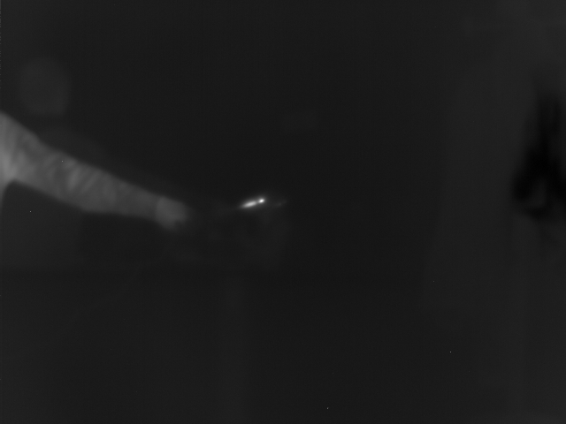

# py-assessment
Tester les connaissances techniques des alternants en Python

## Consignes
Afin d'évaluer au mieux vos compétences, il est nécessaire de détailler vos démarches pour réussir l'exercice.
Pour cela,lorsqu'il s'agit de code veuillez le commit à chaque étape de l'exercice.
Dans le cas de commandes, ou d'établissement de votre environnement de travail, décrivez les dans le readme, en-dessous de l'étape à la place des "..."

## Mise en place de l'exercice (Git, python3)
1. Avec github, faites un fork de ce repo

  - Aller sur la page du dépôt original ("repo") sur GitHub.
  - Cliquer sur le bouton "Fork" pour créer une copie du dépôt
  ...
   
3. Clonez votre fork sur votre appareil
   
  - Télécharger le fork du dépot sur la machine
  ...
   
4. Créez une branche que vous nommerez comme vous voulez

  - Créer une branche appelée "fares" dans notre cas
  ...

6. Créez un environnement virtuel nommé "env" avec pip3 et venv et activez le

  dans le terminal et le dossier du dépôt : 
    python -m venv env
    .\env\Scripts\activate
  ...

7. Installez les "requirements" pour cet environnement

  pip install -r requirements.txt
...

## Exercice 1
!! Attention à bien faire un commit après chaque étape !!

1. Chargez une image binaire 640x480 en nuance de gris
2. Normalisez cette image sur 8 bits
3. Enregistrez le résultat au format png

Résultat souhaité:

## Exercice 2
!! Attention à bien faire un commit après chaque étape !!

1. Chargez l'image
2. Tracez un histogramme des valeurs des pixels de l'image par bande spectrale (RGB)
3. Affichez la taille de l'image
4. Cropez l'image autour du château aux dimensions ci-dessous
5. Analysez l'histogramme pour segmenter le chateau avec un seuil
6. Enregistrez vos resultats

Dans les cas ou vous n'arrivez pas à coder les exercices vous pouvez expliquer la démarche que vous auriez appliqué.
